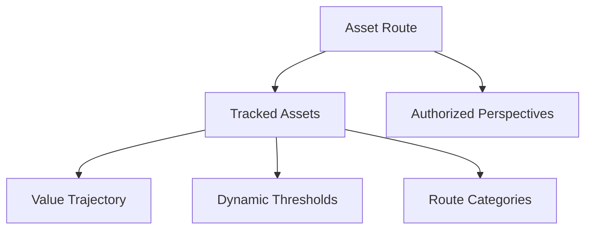

# Moralis Route: Smart Asset Tracking

A cutting-edge blockchain solution for transparent, secure, and granular digital asset management on the Stacks network.

## Overview

Moralis Route enables advanced digital asset tracking with:
- Comprehensive asset registration and routing
- Real-time valuation and performance tracking
- Customizable monitoring and access controls
- Immutable record-keeping for compliance
- Flexible privacy and sharing mechanisms

## Architecture

The system leverages a route-based tracking model, allowing users to map and monitor digital assets with unprecedented precision.



### Core Components:
- **Routes**: Intelligent asset tracking pathways
- **Assets**: Detailed digital asset profiles
- **Trajectory**: Comprehensive valuation history
- **Categories**: Flexible asset classification
- **Thresholds**: Intelligent monitoring rules
- **Access Control**: Granular viewer permissions

## Contract Documentation

### Primary Contract: route-tracker.clar

The core contract powering Moralis Route's asset management capabilities.

#### Key Data Structures:
- `tracked-assets`: Comprehensive asset details
- `asset-trajectory`: Valuation movement tracking
- `route-categories`: Dynamic asset classification
- `route-metadata`: Contextual asset information
- `authorized-perspectives`: Controlled visibility

## Getting Started

### Prerequisites
- Clarinet CLI
- Stacks-compatible wallet

### Basic Usage

1. Initialize a route:
```clarity
(contract-call? .route-tracker initialize-route "personal-crypto")
```

2. Register an asset:
```clarity
(contract-call? .route-tracker register-asset 
    "btc-primary" 
    "Primary Bitcoin Holdings" 
    "Cryptocurrency" 
    u1635724800 
    u50000 
    u55000 
    none 
    false)
```

3. Update asset tracking:
```clarity
(contract-call? .route-tracker update-asset-trajectory "btc-primary" u60000)
```

## Function Reference

### Asset Management

#### register-asset
```clarity
(register-asset 
    (asset-identifier (string-ascii 36))
    (name (string-utf8 100))
    (route-category (string-ascii 50))
    (acquisition-timestamp uint)
    (initial-value uint)
    (current-value uint)
    (metadata (optional (string-utf8 1000)))
    (public-visibility bool))
```

### Monitoring & Control

#### set-route-threshold
```clarity
(set-route-threshold
    (asset-identifier (string-ascii 36))
    (threshold-id (string-ascii 36))
    (comparison (string-ascii 2))
    (value uint)
    (description (optional (string-utf8 200))))
```

## Development

### Local Testing
```bash
clarinet test
clarinet console
```

## Security Paradigm

### Access Architecture
- Owner-centric authentication
- Granular viewer permissions
- Configurable asset visibility

### Data Integrity
- Immutable tracking records
- Selective metadata exposure
- Cryptographically secure tracking

### Architectural Boundaries
- Integer-based valuations
- Discrete asset tracking
- External threshold monitoring

### Recommended Practices
- Rotate viewer access regularly
- Use time-bound permissions
- Minimize exposed metadata
- Validate all input transactions